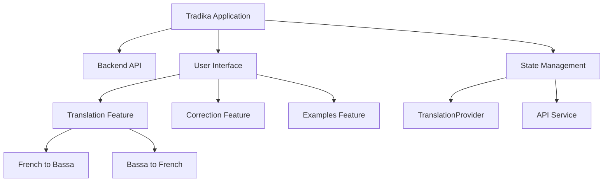
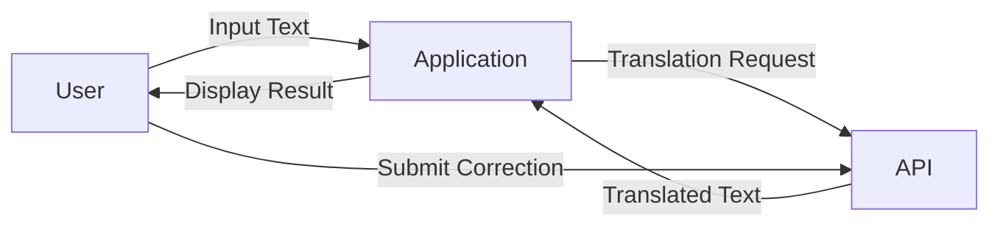
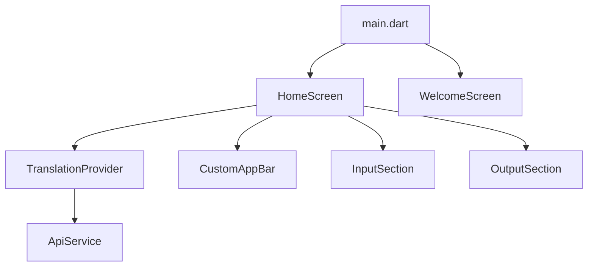
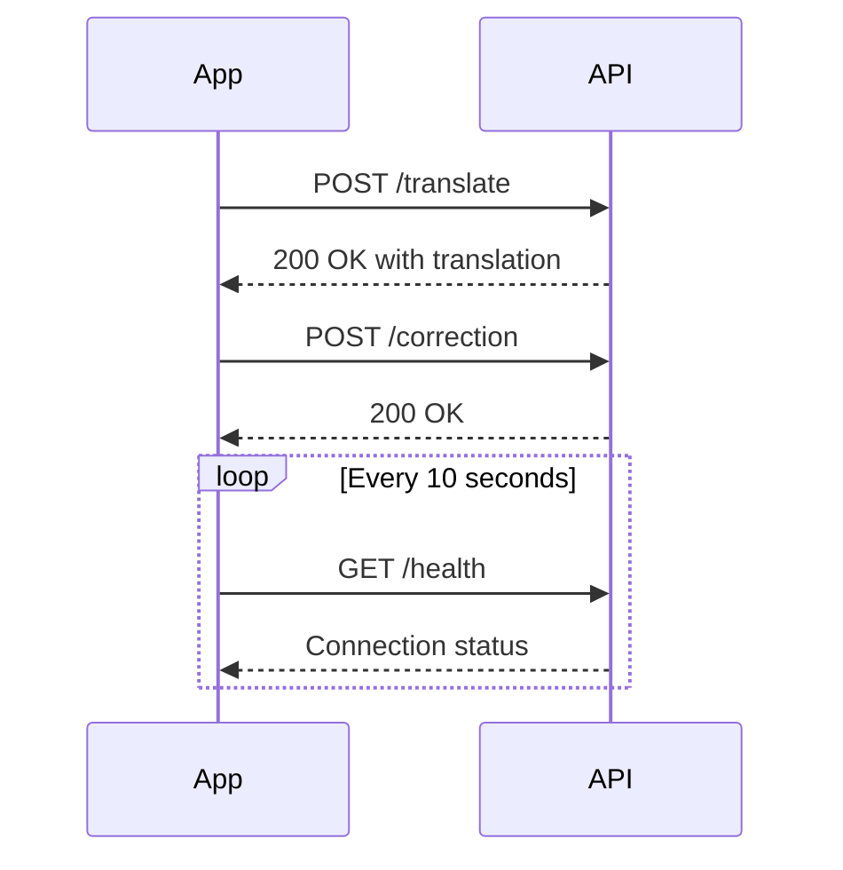
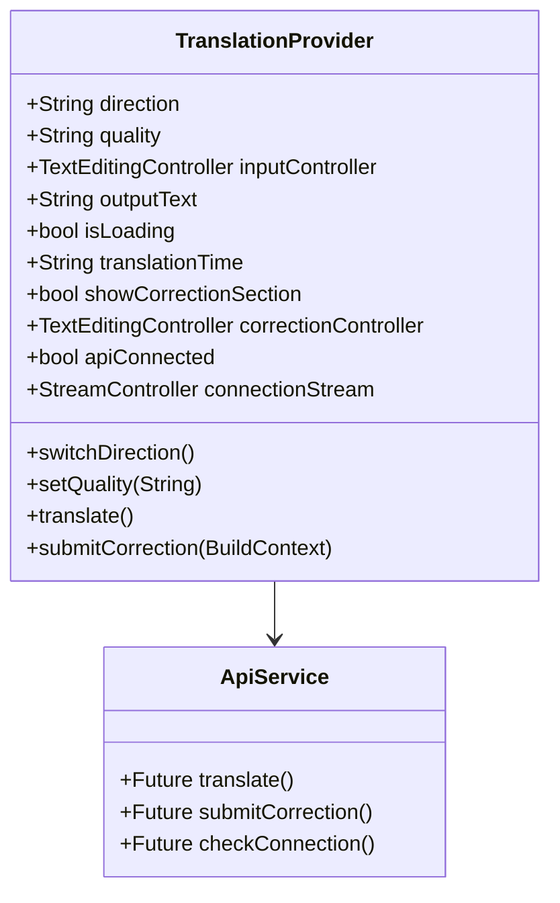
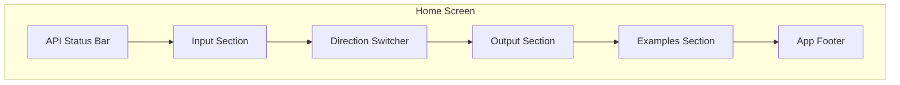
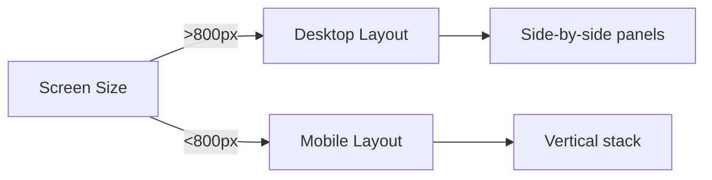
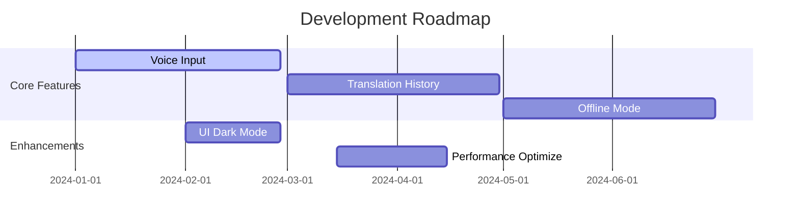

# Tradika - Software Documentation

[](https://play.google.com/store/apps/details?id=com.jintelias.tradika)
[](https://jintelias.tradika.com)



## Table of Contents
1. [Application Overview](#application-overview)
2. [Architecture](#architecture)
3. [Core Components](#core-components)
4. [API Integration](#api-integration)
5. [State Management](#state-management)
6. [User Interface](#user-interface)
7. [Getting Started](#getting-started)
8. [Troubleshooting](#troubleshooting)
9. [Future Improvements](#future-improvements)

## Application Overview <a name="application-overview"></a>

Tradika is a bilingual translation application that facilitates real-time translation between French and Bassa, a Cameroonian language. The application provides:

- Instant text translation with quality options
- User correction submission system
- Example phrases for quick testing
- API connection monitoring
- Responsive design for all screen sizes



## Architecture <a name="architecture"></a>

### Tech Stack
- **Frontend**: Flutter (Dart)
- **State Management**: Provider
- **API**: HTTP RESTful service
- **Local Storage**: Shared Preferences
- **Build Tools**: Flutter SDK

### Application Structure
```
lib/
├── api/
│   └── api_service.dart
├── models/
│   └── translation.dart
├── providers/
│   └── translation_provider.dart
├── screens/
│   ├── home_screen.dart
│   └── welcome_screen.dart
│   └── history_screen.dart
│   └── settings_screen.dart
├── widgets/
│   ├── app_footer.dart
│   ├── custom_app_bar.dart
│   ├── example_selection.dart
│   ├── input_section.dart
│   ├── output_section.dart
│   ├── quality_selector.dart
│   └── translation_direction_selector.dart
├── app_theme.dart
├── constants.dart
└── main.dart
```



## Core Components <a name="core-components"></a>

### 1. ApiService
Handles all API communications with the translation backend.

Key features:
- Translation requests
- Correction submissions
- Health checks
- Error handling

### 2. TranslationProvider
Manages application state using Provider pattern.

State includes:
- Translation direction (fr→bs or bs→fr)
- Translation quality (fast, balanced, best)
- Input/output text controllers
- API connection status
- Loading states

### 3. HomeScreen
Main application screen with:
- Input and output sections
- Direction switcher
- Quality selector
- Translation button
- Correction interface

### 4. WelcomeScreen
Onboarding screen for first-time users:
- Three-step introduction
- App features overview
- "Get Started" button

## API Integration <a name="api-integration"></a>

### Endpoints
| Endpoint | Method | Parameters | Description |
|----------|--------|------------|-------------|
| `/translate` | POST | `{text, direction, quality}` | Performs translation |
| `/correction` | POST | `{original, translation, correction, direction}` | Submits user corrections |
| `/health` | GET | - | Checks API status |

### Request Flow


### Error Handling
- **Translation errors**: Display "API connection failed"
- **Correction errors**: Show snackbar with error message
- **Connection issues**: Visual indicator in status bar

## State Management <a name="state-management"></a>

### Provider Architecture


### Key Methods
1. `translate()`:
    - Validates input
    - Shows loading state
    - Calls API
    - Updates output text
    - Calculates translation time

2. `switchDirection()`:
    - Swaps input and output text
    - Changes translation direction

3. `submitCorrection()`:
    - Validates correction input
    - Sends to API
    - Updates UI with success/error

## User Interface <a name="user-interface"></a>

### Screen Layouts



### Responsive Design


### UI Components
1. **InputSection**:
    - Quality selector chips
    - Multiline text field
    - Clear text button
    - Translate button with loading indicator

2. **OutputSection**:
    - Translation result display
    - Quality and time indicators
    - Correction text field
    - Submit correction button

3. **CustomAppBar**:
    - App logo
    - App name
    - Language direction
    - API connection indicator

4. **TranslationDirectionSwitcher**:
    - Circular button with swap icon
    - Direction tooltip
    - Visual feedback on press

## Getting Started <a name="getting-started"></a>

### Prerequisites
- Flutter SDK 3.0+
- Dart 2.17+
- Android Studio/Xcode (for emulators)
- Physical device (recommended)

### Installation
```bash
# Clone repository
git clone https://github.com/your-organization/tradika.git

# Install dependencies
flutter pub get

# Run on connected device
flutter run
```

### Configuration
1. Create `.env` file in root directory:
```env
API_BASE_URL=https://your-api-endpoint.hf.space
API_TOKEN=your_secret_token
```

2. Update `api_service.dart` with your credentials:
```dart
static const String _baseUrl = const String.fromEnvironment('API_BASE_URL');
static const String _apiToken = const String.fromEnvironment('API_TOKEN');
```

### Build Commands
```bash
# Build Android APK
flutter build apk --release

# Build iOS App
flutter build ios --release

# Build Web Version
flutter build web
```

## Troubleshooting <a name="troubleshooting"></a>

### Common Issues
1. **API Connection Failed**:
    - Verify API endpoint in `.env`
    - Check network connectivity
    - Ensure token is valid

2. **Keyboard Overlap Issues**:
    - Confirm `resizeToAvoidBottomInset: true` is set
    - Ensure no fixed heights in layout

3. **State Not Updating**:
    - Verify `notifyListeners()` is called
    - Check Consumer widget placement
    - Ensure using same provider instance

4. **Layout Overflow Errors**:
    - Wrap content in SingleChildScrollView
    - Use Flexible/Expanded widgets appropriately
    - Avoid fixed heights in scrollable areas

### Debugging Tips
```dart
// Enable provider debug logs
Provider.debugCheckInvalidValueType = (value) {
  debugPrint('Provider value: $value');
};

// Log API requests
dio.interceptors.add(LogInterceptor(requestBody: true));
```

## Future Improvements <a name="future-improvements"></a>

### Roadmap


### Planned Features
1. **Voice-to-Text Input**:
    - Speech recognition for hands-free input
    - Audio playback of translations

2. **Translation History**:
    - Local storage of recent translations
    - Favorite phrases system
    - Search history functionality

3. **Offline Mode**:
    - On-device translation capability
    - Cached results for common phrases
    - Background sync with API

4. **User Accounts**:
    - Profile management
    - Sync across devices
    - Contribution tracking

5. **Language Expansion**:
    - Support additional Cameroonian languages
    - Dialect selection options
    - Region-specific vocabulary

### Performance Optimization
- Implement translation caching
- Reduce widget rebuilds
- Optimize image assets
- Lazy loading for examples section
- Code splitting for web version

## Conclusion

Tradika represents a significant step in preserving and promoting Africa languages through technology. The application combines modern software engineering practices with user-centered design to create an accessible translation tool. This documentation provides a comprehensive overview of the system architecture, implementation details, and future development plans.